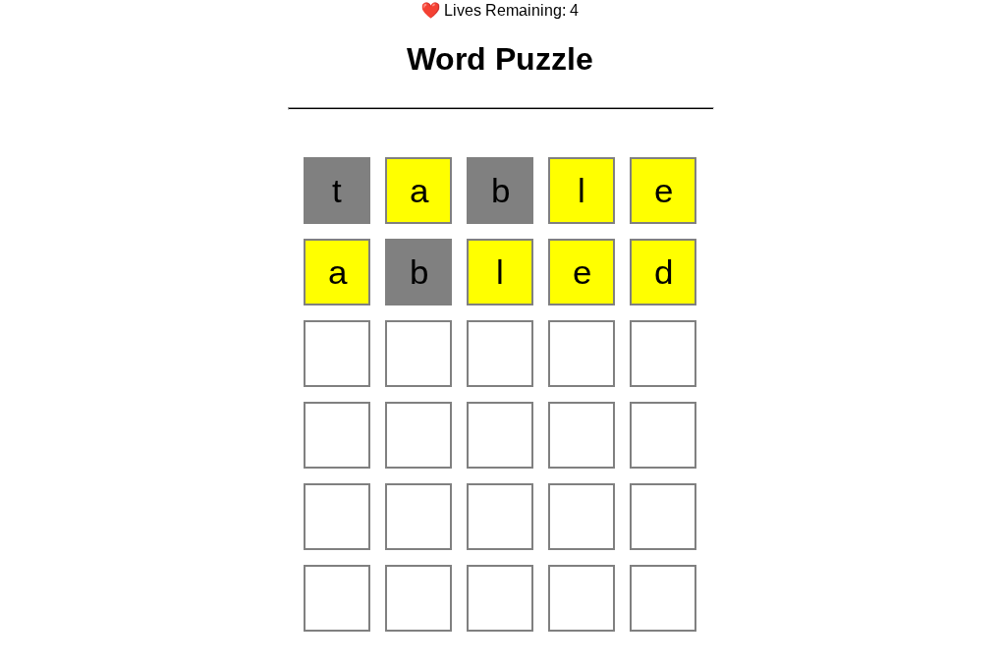

# 🚀 Word Puzzle

⚠️DESKTOP ONLY
This is a simple Wordle-like game, where your objective is to guess the english word randomly generated, with a total of 6 lives until Game Over.

Play Game Here: https://caiky-souza.github.io/Word-Puzzle/templates/index.html

# ⚡ Technologies
This project counts with:

- HTML5
    - Semantic and well structured HTML
    - Usage of containers, classes, meta tags and more…
- CSS3
    - usage of grid and flexbox
    - well separated classes
- Javascript
    - DOM manipulation
    - Input validation and keyboard events
    - Modular structure and game logic
    - GET and POST, using APIs
# 🔧 Functionalities
- The user have 6 lives to guess, until gameover
- Letters can be green if correctly, yellow, if not in exactly position, and gray if not in the word
- Randomly generated word by API
# 📷 Picture

